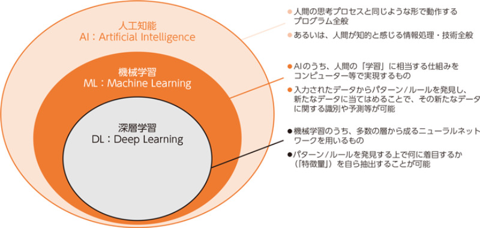
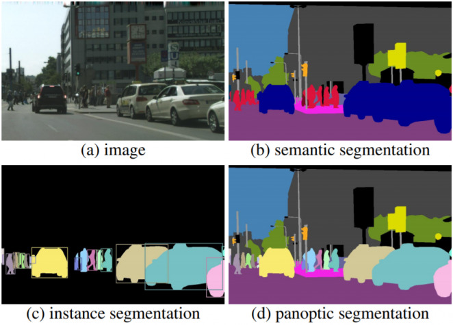

## 機械学習とは
- 機械学習
    * 人間の「学習」に相当するものであり、コンピュータに様々なデータを学習させることでデータの中にあるパターンや規則性を発見するもの
- 深層学習(ディープラーニング)
    * ニューラルネットワークと呼ばれる人間の脳構造を模した技術を用いてデータの中にある特徴を見つけ出す役割を担う

## 機械学習における3つの学習法
- 教師あり学習
    * 明確な正解を持つデータを用いて分析・学習させる手法
- 教師なし学習
    * 正解・不正解が明確ではないデータを用いることで未知のパターンを導き出す手法
- 強化学習

## 機械学習の活用エリア
- 画像系
    * 検出作業、無人店舗、がん細胞の種類判別、画像や絵画の作成
- 自然言語処理
    * 翻訳・変換機能、チャットボット、音声アシスタントサービス
- テーブルデータ
    * 需要予測、人数予測

## 機械学習の手法
- 画像分類（Image Classification）
    * 画像データを学習させることによって与えた画像がどのカテゴリに属するか分類する技術
    * 例えば、犬猫の画像を大量に学習させることで、与えられたが図が犬か猫かを判別できるモデルを作成できる
- 物体検出（Object Detection）
    * 画像や動画データから特定の物体を検出する技術
    * 物体の個数をカウントしたり位置を特定するなど製造業や建設業、医療業界など様々な分野で利用されている
- セグメンテーション（Segmentation）
    * 画像をいくつかのオブジェクト(対象)に分割する技術
    * 例えば、一枚の画像に人と車と犬が写っている場合、それぞれを別のオブジェクトとして識別する
    
- 光学文字認識（OCR: Optical Character Recognition）
    * キスト画像や印刷された文書をコンピュータが読み取り可能な文字コードに変換する技術
- 画像生成
    * 学習したデータをもとに新たな画像を生成する技術
    * 最近ではテキスト入力によって画像を生成する画像生成AIも登場している
- 異常検知
    * 大量の学習データと異なる振る舞いを示すデータを検出する技術
    * データ間の共通点や相違点の分析によって異常を検出する

## 代表的なツール、ライブラリ
- データ処理
    * Numpy
    * pandas
- データ可視化
    * matplotlib
    * seaborn
- 画像処理
    * Opencv
    * Pillow
- 自然言語処理
    * MeCab
    * GINZA
- 機械学習ツール
    * Scikit-learn
- 深層学習
    * PyTorch
    * TnsorFlow
    * Keras
    * Kubeflow
- 強化学習
    * OpenAI Gym
- 深層強化学習
    * Chainer RL
